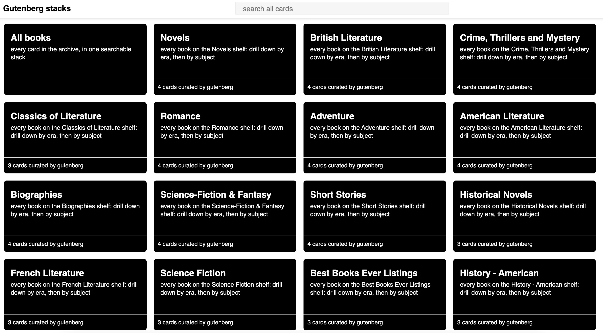
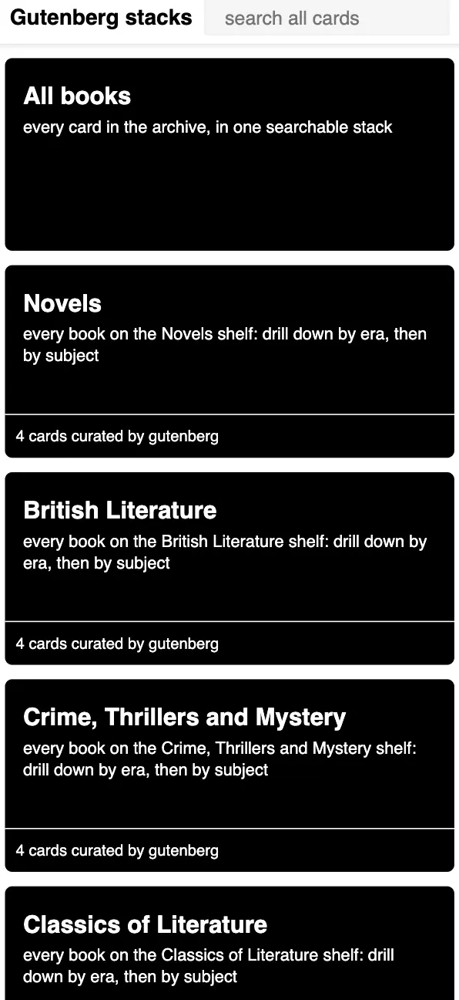
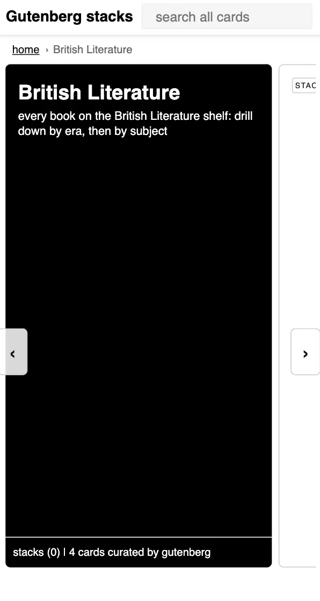
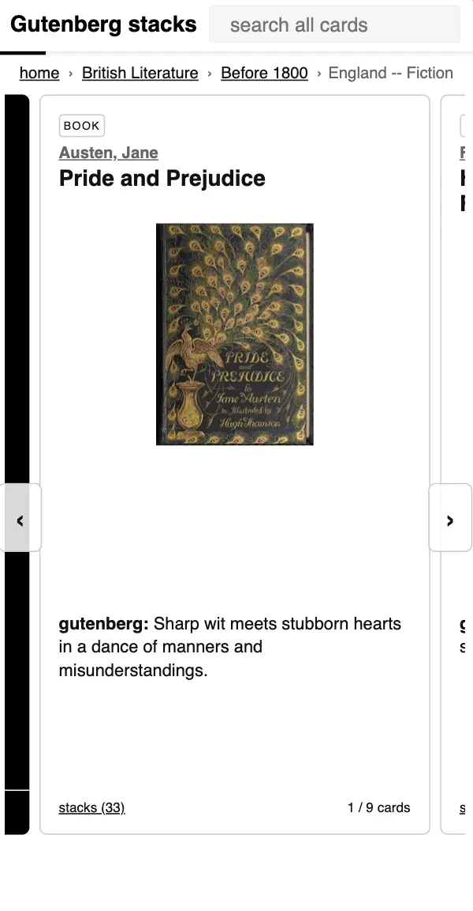

<div align="center">

# 📚 Gutenberg Stacks

**Browse 1,000 top free Project Gutenberg books like a deck of cards.**

[](LICENSE)
[](https://tmfnk.github.io/Gutenberg-Stacks/)
[](web/)
[](pipeline/)
[](https://github.com/TMFNK/Gutenberg-Stacks/actions/workflows/deploy.yml)
[](CONTRIBUTING.md)

</div>

Instead of a search form, you wander: the home screen is a wall of black **stacks** (Project Gutenberg categories), each stack opens into **era** stacks, eras open into **subject** stacks, and subjects hold **book cards**; each card has a cover, author, an LLM-written hook, and a link straight to the free book on gutenberg.org. Every card shows which stacks it lives in ("stacks (N)"), so you can pivot sideways into a different rabbit hole at any point.

It started as a faithful implementation of [Winnie Lim's self-directed learning network prototype](https://winnielim.org/playlists/designing-a-self-directed-learning-network/) and has since grown into a standalone project with its own navigation and mobile improvements. This repo continues [Gutenberg-Book-Finder](https://github.com/TMFNK/Gutenberg-Book-Finder) (full git history preserved); that repo keeps the pre-redesign search/filter interface.

Currently covering the 1,000 most-downloaded books on Project Gutenberg (M1), scaling to the full catalog (~75,000 books) is planned.

<p align="center">
  
  <br><sub>Home, desktop: one black stack per Project Gutenberg category</sub>
</p>
<p align="center">
  
  
  
  <br><sub>Mobile: vertical stacks &middot; a book card with breadcrumbs, author link, and the "stacks (N)" pivot &middot; the swipe carousel</sub>
</p>

---

## Contents

- [Quick start](#quick-start)
- [The design](#the-design)
- [How it works](#how-it-works)
- [Project layout](#project-layout)
- [Running the pipeline](#running-the-pipeline)
- [Running the frontend](#running-the-frontend)
- [Roadmap](#roadmap)
- [Contributing](#contributing)
- [Acknowledgments](#acknowledgments)

## Quick start

```bash
git clone https://github.com/TMFNK/Gutenberg-Stacks.git
cd Gutenberg-Stacks/web
npm install && npm run dev
```

That's it! `web/public/data/books.json` is already committed, so the site runs with no pipeline, no API keys, no backend. Open the printed `localhost` URL and start browsing. (Full pipeline setup: [Running the pipeline](#running-the-pipeline).)

## The design

The UI began as a read-only port of the [learn prototype](https://learn-e4341.firebaseapp.com/) (Vue + Firebase, 2017) that Winnie Lim built across her design essays (v0.1–v0.3): the same card anatomy, the same nested-stack drill-down, the same "stacks (N)" pivot modal, the same plain black-and-white visual language, all applied to the Gutenberg archive. Unlike her prototype, this is a standalone, framework-free static site: plain HTML and CSS with TypeScript that compiles to vanilla JS, no Vue, no Firebase, no backend.

- **Home**: one stack per PG bookshelf, plus an "All books" stack with client-side full-text search
- **Drill down**: Category → Era (Before 1800 / 19th / 20th century / Undated) → Subject → books; nested stacks render as cards, exactly like the prototype
- **Pivot**: books belong to many stacks; the "stacks (N)" modal jumps between them
- **Mobile**: full-height swipeable card carousel inside a stack (CSS scroll-snap), vertical list everywhere else

Where the project deliberately improves on the prototype (fidelity is an influence, not a constraint):

- **Authors are stacks too**: the author name on any card links to a stack of every book by that author, reachable also through the pivot modal and search
- **Breadcrumbs** (`home › category › era › subject`) under the header: one tap back up the drill-down, no browser back button needed
- **Swipe discoverability** on mobile: the next card peeks in from the edge, ‹ › buttons page through the deck, and the first stack of a session plays a one-time swipe nudge
- **Global search** across all stacks and books from any screen

Stacks are derived in the browser at load time from `books.json` so the site stays fully static. The full research trail and decision log lives in the maintainer's vault (`Projects/Gutenberg-Book-Finder/Winnie-Lim-Stacks-Redesign.md`).

## How it works

A Python pipeline builds the book data once, offline. Nothing is scraped from the gutenberg.org website: metadata comes from the [Gutendex](https://gutendex.com/) API, which serves Project Gutenberg's own official catalog data, and book texts are downloaded once from PG's public files. (At full-catalog scale the pipeline will switch to PG's [offline RDF catalog dump](https://www.gutenberg.org/ebooks/offline_catalogs.html) directly.)

1. **Catalog**: fetch book metadata (title, author, subjects, download counts) from the [Gutendex](https://gutendex.com/) API.
2. **Excerpts**: download each book's plain text, strip the Project Gutenberg boilerplate, keep the first ~2,000 words.
3. **Embed**: embed title + subjects + excerpt locally with `sentence-transformers` (multilingual, runs on-device, no API cost).
4. **Layout**: project embeddings to 2D with UMAP, group into clusters with HDBSCAN.
5. **Enrich**: an LLM (via [OpenRouter](https://openrouter.ai/)) names each cluster and tags every book with a mood, themes, difficulty, and one-line hook.
6. **Export**: write compact JSON consumed by the frontend.

The fetched metadata (catalog, LLM tags, exported book data) is committed to this repo, so the frontend runs without re-running the pipeline.

The frontend is a static site: Vite + TypeScript, no framework. Search is client-side via [MiniSearch](https://github.com/lucaong/minisearch). No server required; deploys to GitHub Pages on every push to `main`.

## Project layout

```text
pipeline/   Python data pipeline (uv-managed)
  src/gutenberg_galaxy/
    catalog.py    Gutendex catalog fetch + cache
    excerpts.py   book text download + boilerplate stripping
    embed.py      local sentence-transformers embeddings
    layout.py     UMAP projection + HDBSCAN clustering
    enrich.py     LLM cluster labels + per-book tags
    export.py     writes web/public/data/*.json
    openrouter.py thin OpenRouter chat client
  tests/        pytest suite
web/        Vite + TypeScript frontend
  src/
    stacks.ts   derives the category → era → subject stack tree
    views.ts    card/stack rendering + the "stacks (N)" pivot modal
    main.ts     data load + hash router (#/, #/stack/<slug>, #/cards)
    search.ts   MiniSearch full-text search (All books view)
docs/       design spec and implementation plan
```

## Running the pipeline

```bash
cd pipeline
uv sync
export OPENROUTER_API_KEY=...   # required for the enrich stage
uv run python -m gutenberg_galaxy all       # runs every stage
uv run python -m gutenberg_galaxy catalog   # or run one stage at a time
uv run pytest                                # run tests
```

Each stage caches its output under `data/` and skips work already done, so the pipeline is safe to re-run or resume after an interruption.

## Running the frontend

```bash
cd web
npm install
npm run dev
```

Requires `web/public/data/books.json`, produced by the `export` pipeline stage (already committed to the repo).

## Roadmap

- **M1 (done):** pipeline + site running end-to-end on the 1,000 most-downloaded books.
- **M2:** scale the pipeline to the full ~78,000-book catalog, and switch the catalog stage to Project Gutenberg's [offline RDF dump](https://www.gutenberg.org/ebooks/offline_catalogs.html) and the excerpt stage to its weekly text-file archive, since a paginated API isn't the sanctioned route at that volume.
- **M3 and beyond:** open-source, forkable, and extendable. See [Contributing](#contributing) if you'd like to help shape it. Ideas so far: richer filtering (mood, difficulty, language), reading-list/collections, and performance work for the full catalog.

## Contributing

Contributions are welcome! This is a small early-stage static site, so the barrier to entry is low. See [CONTRIBUTING.md](CONTRIBUTING.md) for dev setup, the checks a PR needs to pass, and how to file a good bug report or feature request.

## Acknowledgments

- [Winnie Lim](https://winnielim.org/playlists/designing-a-self-directed-learning-network/): the card-and-stack learning-network design this project is built on
- [Project Gutenberg](https://www.gutenberg.org/): the public-domain books that make this possible
- [Gutendex](https://gutendex.com/): serves Project Gutenberg's catalog as a clean JSON API
- [OpenRouter](https://openrouter.ai/): LLM access for cluster labels and per-book hooks
- [MiniSearch](https://github.com/lucaong/minisearch): client-side full-text search

## Design & planning docs

- [docs/design.md](docs/design.md): original M1 design spec (the pre-redesign "Gutenberg Galaxy" star-map concept; the pipeline sections still apply)
- [docs/superpowers/plans/2026-07-04-m1-pipeline-and-map.md](docs/superpowers/plans/2026-07-04-m1-pipeline-and-map.md): M1 implementation plan

---

<div align="center">

Free books, freely browsed. If this scratched an itch, a ⭐ helps others find it.

[AGPL-3.0](LICENSE) &middot; built on [Project Gutenberg](https://www.gutenberg.org/)

</div>
